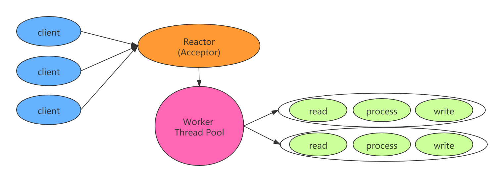
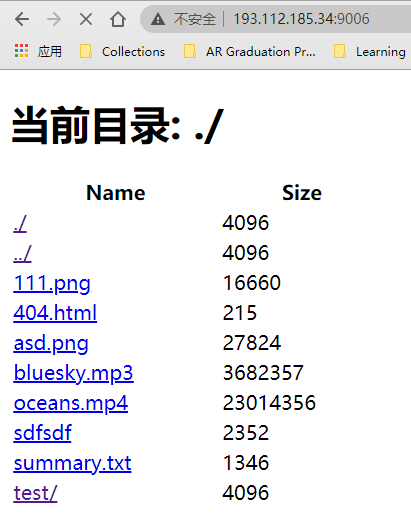
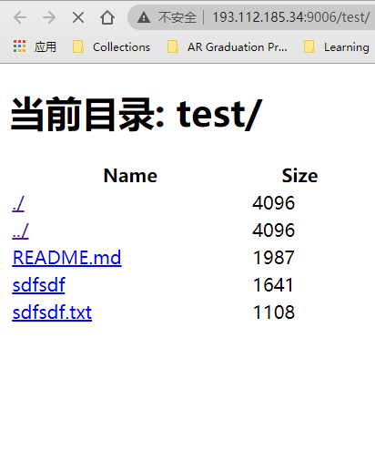
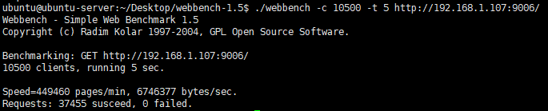

HTTPServer
=====

## 简介

学习Linux网络编程，实现Linux下C++文件服务器。

## 环境

- 操作系统 linux, ubuntu 18.04
- 编译器 g++ 7.4.0

## 功能

- 利用Epoll边沿触发的IO多路复用技术与线程池实现多线程的Reactor并发模型
- 使用正则和有限状态机解析HTTP请求报文，支持GET请求
- 利用标准库容器封装char，实现自动增长的缓冲区

## 框架



## 项目细节

- bulid

  ```sh
  make
  ```

- run

  端口port

  ```c++
  ./server port
  ```

- 演示

             

- [x] 文件根目录root/
- [x] listenfd和connfd使用LT + ET组合
- [x] 线程池内有8条线程
- [x] Reactor反应堆模型

## 压力测试

### 测试环境

- CPU：AMD Ryzen 5 2600
- 内存：8G
- linux, ubuntu 16.04, g++ 7.5.0

### 测试工具

Webbench是有名的网站压力测试工具。

> - 测试处在相同硬件上，不同服务的性能以及不同硬件上同一个服务的运行状况。
> - 展示服务器的两项内容：每分钟输出的页面数和每秒钟传输数据量。

### 测试规则

- 测试样例

  ```shell
  ./webbench -c 10500 -t 5 http://192.168.1.107:9006/
  ```

- 参数

> - `-c` 表示客户端数
> - `-t` 表示时间

### 测试结果

Webbench对服务器进行压力测试，经压力测试可以实现上万的并发连接.

> - 并发连接总数：10500
> - 访问服务器时间：5s
> - 每分钟输出页面数：449460 pages/min
> - 每秒钟传输数据量：6746377 bytes/sec
> - 所有访问均成功



## TODO

- 实现定时器，关闭超时的非活动连接
- 实现日志系统，记录服务器运行状态

## 参考资料

- 《linux高性能服务器编程》游双
- [TinyWebServer](https://github.com/qinguoyi/TinyWebServer)
